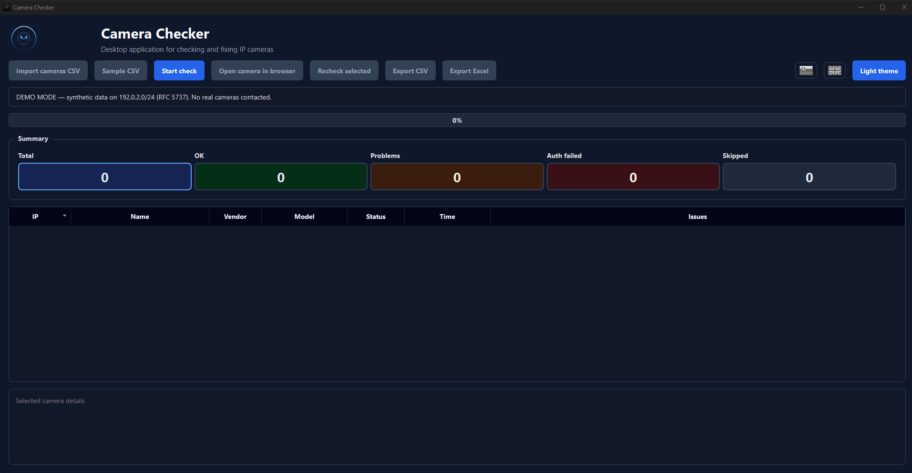

# Camera Checker

---

## EN — English

Desktop application for auditing **Dahua and Hikvision IP cameras** — checks NTP servers,
DST settings and clock drift in parallel, surfaces issues per camera, and lets you fix
them straight from the UI.



### Features

- Import camera list from a CSV file
- Parallel check of NTP, DST and time drift across all cameras
- Filter results by status (OK / problem / auth failed / skipped) via clickable stat cards
- Recheck a single camera after fixing it
- Export results to CSV or Excel
- Open the camera's web UI directly from the app
- **Edit reference values (NTP servers, DST schedule, drift tolerance) directly from the UI** — persisted between sessions, fall back to `config.py` defaults
- Built-in demo mode with synthetic data on `192.0.2.0/24` (RFC 5737) — no real cameras contacted
- SK / EN UI, dark / light theme

### Download

Pre-built binary is available on the [Releases](https://github.com/Orimslav/camera_checker/releases/latest) page:

| Platform | File |
|----------|------|
| Windows | `CameraChecker.exe` |

### Requirements (run from source)

- Python 3.10+
- PySide6 6.8.1
- requests 2.32.3 · openpyxl 3.1.5

### Installation (run from source)

```bash
git clone https://github.com/Orimslav/camera_checker.git
cd camera_checker

python -m venv venv
venv\Scripts\activate           # Windows

pip install -r requirements.txt
```

### Usage

```bash
# Run the application
python main.py

# Run the built-in demo (English UI, synthetic data, no network calls)
python main.py --demo
```

`main.py` automatically re-launches itself under the project's `venv` if one exists,
so it never silently runs against your global Python.

### CSV format

A CSV file with these columns:

| Column | Used for |
|--------|----------|
| `Web Site` | Camera URL — IP is extracted by regex |
| `Login Name` or `Username` | HTTP auth username |
| `Password` | HTTP auth password |
| `Account` | Friendly camera name |
| `Comments` | Optional — model code (`IPC-…`, `DS-…`) is parsed from here |

Rows missing IP, username or password are silently skipped.

### What gets checked

| Check | Notes |
|-------|-------|
| **Authentication** | HTTP Digest then HTTP Basic (Dahua) · ISAPI auth (Hikvision) |
| **Current time** | Reads camera clock, compares to host time |
| **Clock drift** | Flagged as problem when `|drift| > 60s` |
| **NTP settings** | Server address, port, enabled flag — compared to reference values (editable in the UI Settings dialog) |
| **DST settings** | Start/end month, week, day, hour — compared to EU schedule (editable in the UI Settings dialog) |

### Vendor detection and skipping

When a row is loaded, the app picks how to handle it based on the **`Comments`** (model)
and **`Account`** (name) columns of the CSV, matched case-insensitively against keyword
lists in `dahuawin/config.py`:

| Bucket | Keywords (config.py) | Behavior |
|--------|----------------------|----------|
| Hikvision | `HIKVISION_KEYWORDS` — `DS-`, `HIKVISION` | Hikvision ISAPI handler |
| Switch | `SWITCH_KEYWORDS` — `SWITCH`, `POE SWITCH`, `DGS-`, `PORTS POE` | **Skipped** — no network calls, shown in the table as "skipped" with reason `Switch` |
| Server | `SERVER_KEYWORDS` — `SERVER` | **Skipped** — shown as "skipped" with reason `Server` |
| Dahua | `DAHUA_PREFIXES` — `DH-`, `DHI-`, `IPC-`, `NVR`, `DVR`, `XVR`, `HCVR`, `VTO`, `VTH` | Dahua CGI handler |
| Unknown | none of the above (empty model also lands here) | Falls back to Dahua handler |

A practical consequence: to skip an individual device without editing `config.py`, just
write `SWITCH` or `SERVER` into its `Comments` column in the CSV — matching runs over
the combined `model + name` string.

Manual per-IP exclusion still goes through `config.SKIP_IPS` (no keyword needed).
Skipped devices stay visible in the results table so you don't lose track of them.

### Configuration

**Reference values for the checks** can be edited from the **Settings** button in the toolbar:

- Allowed NTP server addresses (whitelist) + port + enabled flag
- Full DST schedule (start / end — month, week, day, hour) + DST enabled flag
- Max. time drift tolerance in seconds

These values are persisted via `QSettings` (Windows registry under `HKCU\Software\OFZ\Camera Checker`) and fall back to the defaults in `config.py` when nothing has been set yet. Use **Restore defaults** in the dialog to clear the override.

Other site-specific policy still lives in `dahuawin/config.py`:

- `EXPECTED_NTP_*`, `EXPECTED_DST`, `MAX_TIME_DIFF_SECONDS` — **defaults** used when the UI override is empty
- `SLOW_IPS` — cameras that need the longer 20s timeout
- `SKIP_IPS` — manually excluded cameras
- `MAX_WORKERS` — parallel check concurrency (default 10)
- Vendor detection keyword lists

---

## SK — Slovensky

Desktopová aplikácia na kontrolu **Dahua a Hikvision IP kamier** — paralelne overí
NTP servery, DST nastavenia a časovú odchýlku, ukáže problémy po jednotlivých kamerách
a umožní ich opraviť priamo z aplikácie.


### Funkcie

- Import zoznamu kamier z CSV súboru
- Paralelná kontrola NTP, DST a časovej odchýlky na všetkých kamerách
- Filtrovanie výsledkov podľa stavu (OK / problém / chyba prihlásenia / preskočené) cez klikateľné štatistické karty
- Opätovná kontrola jednej kamery po oprave
- Export výsledkov do CSV alebo Excelu
- Otvorenie web rozhrania kamery priamo z aplikácie
- **Úprava referenčných hodnôt (NTP servery, DST rozvrh, tolerancia odchýlky) priamo z UI** — pamätajú sa medzi spusteniami, defaulty z `config.py`
- Vstavaný demo režim so syntetickými dátami na `192.0.2.0/24` (RFC 5737) — žiadne skutočné kamery
- SK / EN rozhranie, tmavá / svetlá téma

### Stiahnutie

Pripravená binárka je dostupná na stránke [Releases](https://github.com/Orimslav/camera_checker/releases/latest):

| Platforma | Súbor |
|-----------|-------|
| Windows | `CameraChecker.exe` |

### Požiadavky (spustenie zo zdrojového kódu)

- Python 3.10+
- PySide6 6.8.1
- requests 2.32.3 · openpyxl 3.1.5

### Inštalácia (spustenie zo zdrojového kódu)

```bash
git clone https://github.com/Orimslav/camera_checker.git
cd camera_checker

python -m venv venv
venv\Scripts\activate           # Windows

pip install -r requirements.txt
```

### Spustenie

```bash
# Spustenie aplikácie
python main.py

# Spustenie vstavaného demo režimu (anglické UI, syntetické dáta, žiadne sieťové volania)
python main.py --demo
```

`main.py` sa pri spustení automaticky prepne na projektový `venv` ak existuje,
takže nikdy nebude potichu bežať z globálneho Pythonu.

### Formát CSV

CSV súbor s týmito stĺpcami:

| Stĺpec | Použitie |
|--------|----------|
| `Web Site` | URL kamery — IP sa vytiahne regexom |
| `Login Name` alebo `Username` | HTTP auth meno |
| `Password` | HTTP auth heslo |
| `Account` | Zobrazený názov kamery |
| `Comments` | Voliteľné — model (`IPC-…`, `DS-…`) sa parsuje odtiaľto |

Riadky bez IP, mena alebo hesla sa ticho preskočia.

### Čo sa kontroluje

| Kontrola | Poznámka |
|----------|----------|
| **Autentifikácia** | HTTP Digest potom HTTP Basic (Dahua) · ISAPI auth (Hikvision) |
| **Aktuálny čas** | Načíta hodiny kamery, porovná s časom hostu |
| **Časová odchýlka** | Označená ako problém keď `|odchýlka| > 60s` |
| **NTP nastavenia** | Adresa servera, port, enable flag — porovnané s referenčnými hodnotami (editovateľné v dialógu Nastavenia) |
| **DST nastavenia** | Začiatok/koniec — mesiac, týždeň, deň, hodina — porovnané s EU rozvrhom (editovateľné v dialógu Nastavenia) |

### Detekcia výrobcu a preskakovanie

Pri načítaní riadku appka rozhodne ako ho spracovať podľa stĺpcov **`Comments`** (model)
a **`Account`** (názov) z CSV — porovnáva ich case-insensitive so zoznamami kľúčových
slov v `dahuawin/config.py`:

| Bucket | Kľúčové slová (config.py) | Správanie |
|--------|---------------------------|-----------|
| Hikvision | `HIKVISION_KEYWORDS` — `DS-`, `HIKVISION` | Hikvision ISAPI handler |
| Switch | `SWITCH_KEYWORDS` — `SWITCH`, `POE SWITCH`, `DGS-`, `PORTS POE` | **Preskočené** — žiadne sieťové volania, v tabuľke ako „preskočené" s dôvodom `Switch` |
| Server | `SERVER_KEYWORDS` — `SERVER` | **Preskočené** — v tabuľke ako „preskočené" s dôvodom `Server` |
| Dahua | `DAHUA_PREFIXES` — `DH-`, `DHI-`, `IPC-`, `NVR`, `DVR`, `XVR`, `HCVR`, `VTO`, `VTH` | Dahua CGI handler |
| Unknown | nič z toho (prázdny model sem tiež padá) | Fallback na Dahua handler |

Praktický dôsledok: ak chceš preskočiť konkrétne zariadenie bez zásahu do `config.py`,
stačí do jeho `Comments` stĺpca v CSV napísať `SWITCH` alebo `SERVER` — porovnávanie
beží nad spojeným reťazcom `model + name`.

Manuálne preskočenie podľa IP stále funguje cez `config.SKIP_IPS` (bez potreby keywordu).
Preskočené zariadenia ostávajú viditeľné v tabuľke, aby si o nich nestratil prehľad.

### Konfigurácia

**Referenčné hodnoty pre kontrolu** sa upravujú cez tlačidlo **Nastavenia** v toolbare:

- Povolené NTP adresy (whitelist) + port + enable flag
- Kompletný DST rozvrh (začiatok / koniec — mesiac, týždeň, deň, hodina) + DST enable
- Max. tolerancia časovej odchýlky v sekundách

Hodnoty sa pamätajú cez `QSettings` (Windows registry pod `HKCU\Software\OFZ\Camera Checker`) a ak nie sú nastavené, použijú sa defaulty z `config.py`. **Obnoviť pôvodné** v dialógu vyčistí override.

Ostatná site-špecifická konfigurácia je v `dahuawin/config.py`:

- `EXPECTED_NTP_*`, `EXPECTED_DST`, `MAX_TIME_DIFF_SECONDS` — **defaulty** ktoré platia keď UI override nie je nastavený
- `SLOW_IPS` — kamery ktoré potrebujú dlhší 20s timeout
- `SKIP_IPS` — manuálne vylúčené kamery
- `MAX_WORKERS` — počet paralelných kontrol (predvolene 10)
- Zoznamy kľúčových slov pre detekciu výrobcu
